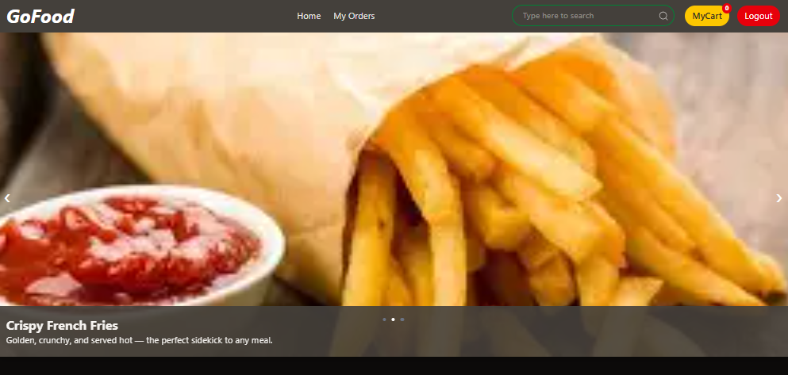
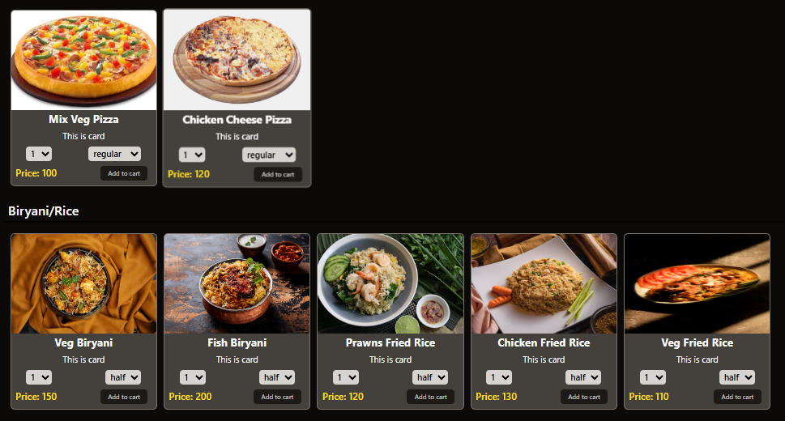
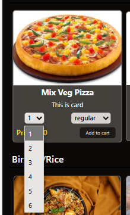
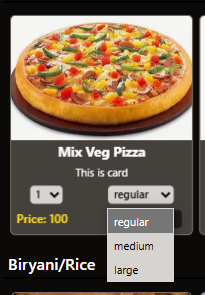
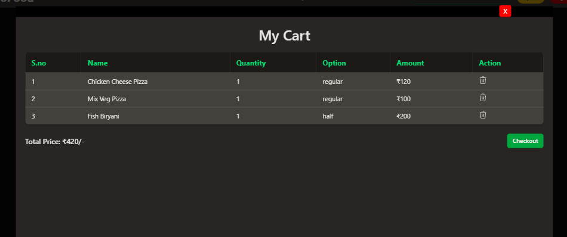
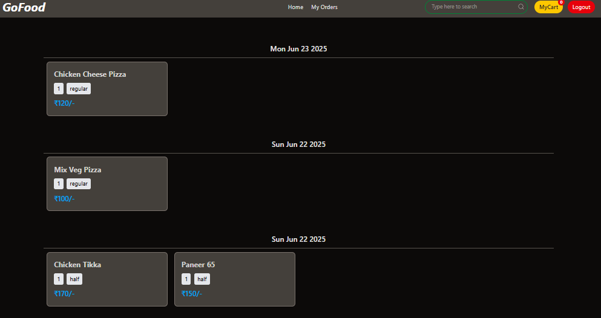
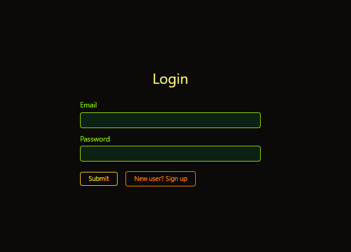
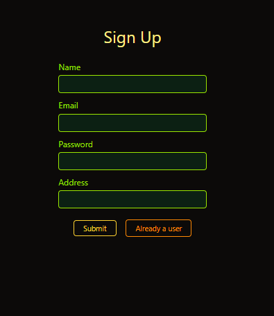

# 🍔 Food Delivery App

An interactive **Food Delivery Web App** built using the **MERN Stack (MongoDB, Express.js, React.js, Node.js)**. Users can register, log in, browse food items, add them to the cart with specific quantity and size, and place orders.

---

## 🌐 Live Demo : [Click Here]()

---

## ✨ Features

- 🔐 **User Authentication** – Sign up, login, logout securely  
- 🔎 **Search** – Instantly search food items by name  
- 🍽️ **Browse Menu** – Explore categorized food items  
- ➕ **Add to Cart** – Select quantity & size of food and add to cart  
- 🛒 **My Cart** – Review cart and place order  
- 📜 **My Orders** – View your past orders  
- 📱 **Fully Responsive** – Mobile-friendly UI  

---

## 🛠️ Tech Stack

| Technology       | Description              |
|------------------|--------------------------|
| **Frontend**     | React.js, Tailwind CSS   |
| **Backend**      | Node.js, Express.js      |
| **Database**     | MongoDB, Mongoose        |
| **Authentication** | JWT (JSON Web Token) |

---

## 📸 Screenshots
 

---

